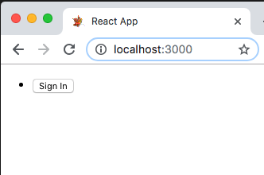
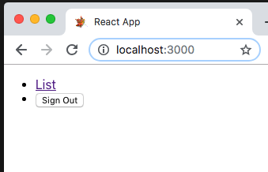
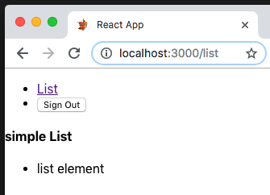

# react-app
react application template

    

<h1 align="center" style="border-bottom: none !important; margin-bottom: 5px !important;">
    <a href="https://github.com/christrees/react-app">React Dashboard Test</a>
</h1>

  
  
  

    Goal: React admin dashboard template for app testing 
       and remote api access testing.

  <a href="http://demo.christrees.com/react-app">demo
    
  </a>
  <a href="https://github.com/christrees/react-app">
    
    repo
  </a>

 

    
    
    

> 🌦 **Note:** Need to update the image above with current screenshot.

### Quick Start

* Install dependencies by running `yarn` or `npm install`.
* Run `yarn start` or `npm run start` to start the local development server.
* 😎🏝 **DONE!** Start hacking an isolated dashboard.

### Documentation

Expanded [react-app Documentation](docs/README.md) in [docs/](docs/README.md).

### Project Structure

- This project is bootstrapped using [Create React App](https://github.com/facebook/create-react-app).
- Documents are located inside `docs/`. 
- The `src/components` directory hosts all template-specific subcomponents in their own subdirectory.
- The layout styles inherited from Dashboard are pulled in from the `src/test-dashboard` submodule inside `src/App.js`.
- Other extra styles specific to the libraries used are located inside `src/assets`.
- The `src/utils` directory contains generic Chart.js utilities.

### Available Scripts

- `npm start` - Runs the app in the development mode.
- `npm test` - Launches the test runner in the interactive watch mode.
- `npm run build` - Builds the app for production to the `build` folder.

### Built with help from

- [Create React App](https://github.com/facebook/create-react-app)
- [Shards React](https://github.com/designrevision/shards-react)

### Changelog

Please check out the [CHANGELOG](CHANGELOG.md).