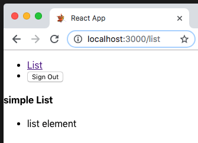

# v0.0.3 Release - Steps Detail

### Working goals

- define and setup directory structure [srcFileStructureExplained.md](../srcFileStructureExplained.md)
- setup for testing [repoTestingExplained.md](../repoTestingExplained.md)
- a simple login 

- a simple logout 

- a simple list 

- 100% code coverage - results at [repoTestingExplained.md](../repoTestingExplained.md)
- Document src structure and test setup
- update favicon.ico

### Step Notes
- update package.json with dependencies
- create basic directory struture
  -  `__tests__` (for integration test)
    - App.test.js (move the App test here)
    - integration.test.js
  - actions ( action types and return functions )
    - `__tests__` (for action unit tests)
      - actions_index.test.js
    - index.js
    - types.js
  - components (visible layout component render functions )
    - `__tests__` (for component unit tests)
    - TestList.js (simple component to display)
  - reducers (redux technique for app state maintainance)
    - `__tests__` (for reducers unit tests)
    - index.js
    - simpleAuthButton.js (user action testing)
- Setup a Root.js node to make testing easier.
  - create Root.js (so we can setup app for testing redux things)
  - create setupTests.js (name hack to pullin Enzyne Adaptor must be in this dir and have "xxxxTests.js" in name)
- create Documents
  - This release doc [v0.0.3-ReleaseNotes.md](v0.0.3-ReleaseNotes.md)
  - Source files Explained [srcFileStructureExplained.md](../srcFileStructureExplained.md)
  - Repo Testing Explained [repoTestingExplained.md](../repoTestingExplained.md)

